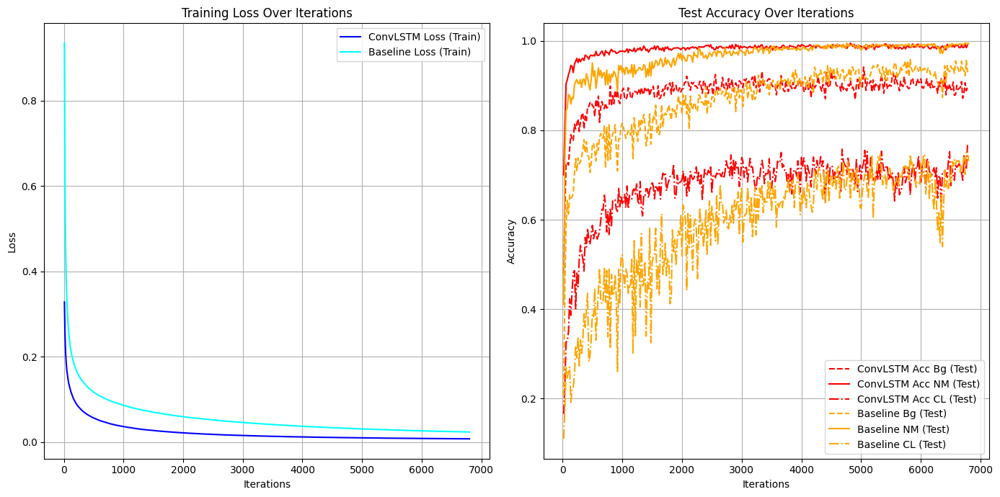
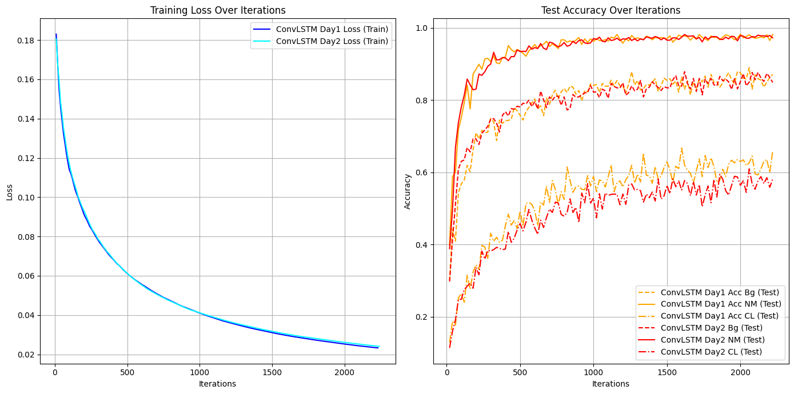
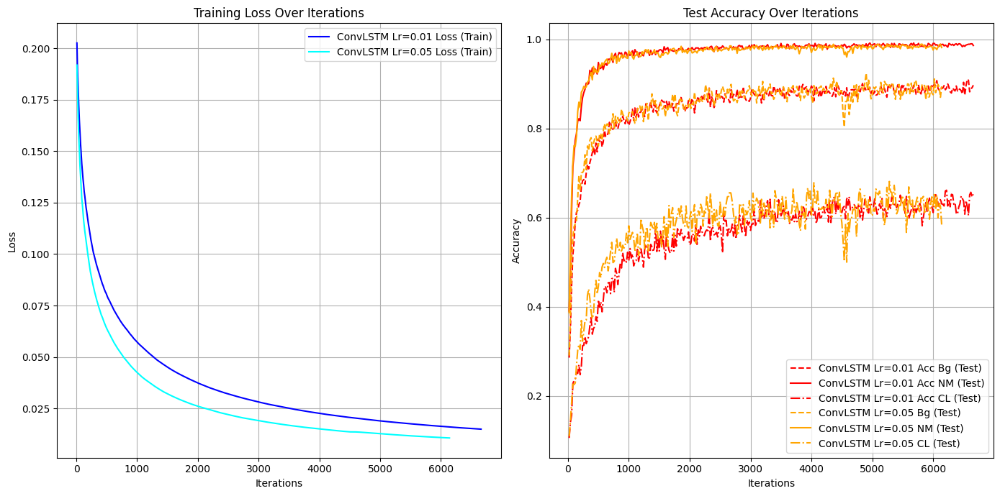
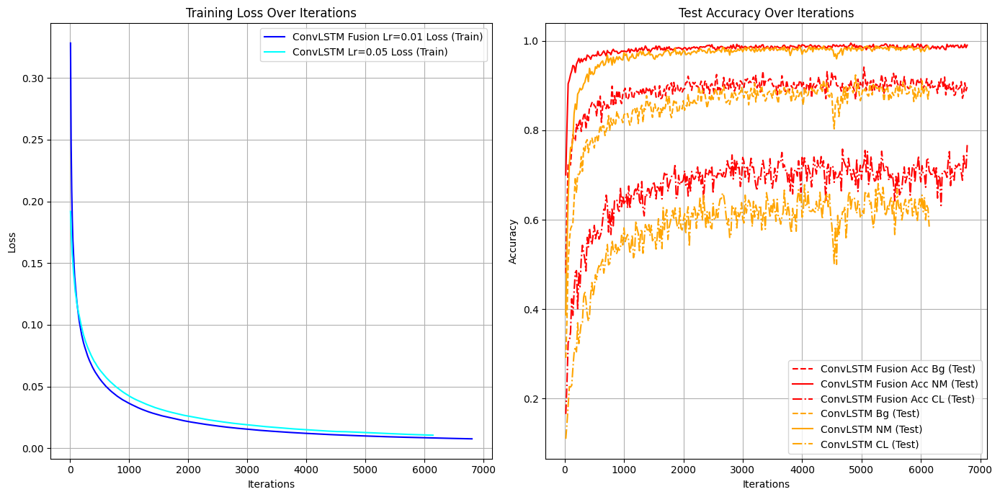

# GaitLab
This repository offers a collection of custom models designed to harness the power of the CASIA-B dataset directly on Google Colab. Users can easily run our comprehensive notebook to experiment with gait recognition, with the flexibility to modify the model section to tailor it to their specific needs.

Built upon the foundations of the OpenGait project, GaitLab enhances and expands the accessibility of gait recognition technologies to a wider audience. Whether you’re a researcher, a developer, or just curious about biometric identification, GaitLab provides you with the tools to explore and innovate in the field of gait analysis.

Dive into our models, contribute to the community, and help shape the future of motion recognition!

* Main Framework to run on Colab 
    * 

# Explanation
## ConvLstm(lr=0.05,+fusion) vs Baseline
* ConvLstm
    * _Fusion.ipynb)
* Baseline
    * 

ConvLstm daha hızlı öğreniyor ve sonuç hemen hemen aynı, cl de daha başarılı

## Neden lr=0.05
Lr=0.1 için resnet9 modeli fazla büyük bir model olmadığı ve parametre sayısı az olduğu için çok dallanma göstermeyebiliyor ve her model çalıştırıldığında farklı sonuçlar elde edilmiyor. Model varacağı max acc noktasına ulaşabiliyor.

Lr=0.1 için ConvLstm kullanıldığında ise her model çalıştığında farklı sonuçlar olabiliyor.

### Lr=0.01 vs lr 0.05
Lr=0.05 olduğu zaman dallanma çok oluyor ama daha yüksek acc değerlerine çıkılabiliyor.

### neden fusion

